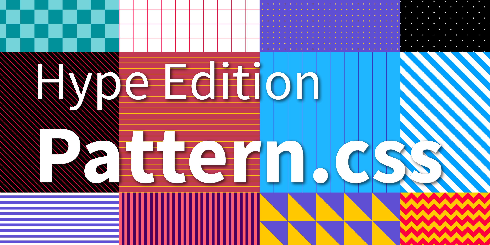

# pattern.css (Hype Edition)



CSS only library to fill your empty background with beautiful patterns
<sup>*1.*</sup>.


## Features

- Only CSS. No JavaScript!
- < 1KB minified and gzipped!
- Supports all modern browsers
- Built Using SCSS.
- Full color control.

## Installation


## Pattern Classes

|small|medium|large|extra large|
|--- |--- |--- |--- |
|pattern-checks-sm|pattern-checks-md|pattern-checks-lg|pattern-checks-xl|
|pattern-grid-sm|pattern-grid-md|pattern-grid-lg|pattern-grid-xl|
|pattern-dots-sm|pattern-dots-md|pattern-dots-lg|pattern-dots-xl|
|pattern-cross-dots-sm|pattern-cross-dots-md|pattern-cross-dots-lg|pattern-cross-dots-xl|
|pattern-diagonal-lines-sm|pattern-diagonal-lines-md|pattern-diagonal-lines-lg|pattern-diagonal-lines-xl|
|pattern-horizontal-lines-sm|pattern-horizontal-lines-md|pattern-horizontal-lines-lg|pattern-horizontal-lines-xl|
|pattern-vertical-lines-sm|pattern-vertical-lines-md|pattern-vertical-lines-lg|pattern-vertical-lines-xl|
|pattern-diagonal-stripes-sm|pattern-diagonal-stripes-md|pattern-diagonal-stripes-lg|pattern-diagonal-stripes-xl|
|pattern-horizontal-stripes-sm|pattern-horizontal-stripes-md|pattern-horizontal-stripes-lg|pattern-horizontal-stripes-xl|
|pattern-vertical-stripes-sm|pattern-vertical-stripes-md|pattern-vertical-stripes-lg|pattern-vertical-stripes-xl|
|pattern-triangles-sm|pattern-triangles-md|pattern-triangles-lg|pattern-triangles-xl|
|pattern-zigzag-sm|pattern-zigzag-md|pattern-zigzag-lg|pattern-zigzag-xl|

---

**Version-History:**  
`1.0	Initial release under MIT `   

## Documentation

See the full [documentation](https://bansal.io/pattern-css)
Hype specific restriction might apply

Content Delivery Network (CDN)
--

Latest version can be linked into your project using the following in the head section of your project:

```html
<link href="https://cdn.jsdelivr.net/gh/worldoptimizer/HypePatternCSS/pattern.min.css" rel="stylesheet">
```

Optionally you can also link a SRI version or specific releases. 
Read more about that on the JsDelivr (CDN) page for this extension at https://www.jsdelivr.com/package/gh/worldoptimizer/HypePatternCSS

Learn how to use the latest extension version and how to combine extensions into one file at
https://github.com/worldoptimizer/HypeCookBook/wiki/Including-external-files-and-Hype-extensions

---

**Footnotes:**

<sup>*1. This is a fork off the great work from the people at https://bansal.io/*</sup>
